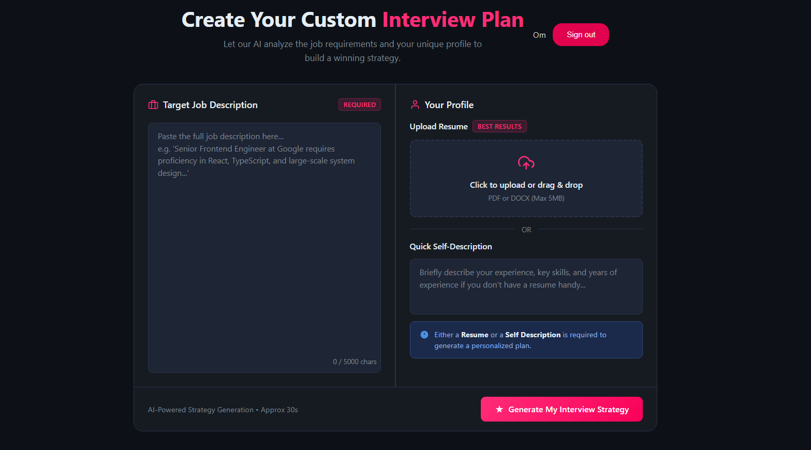
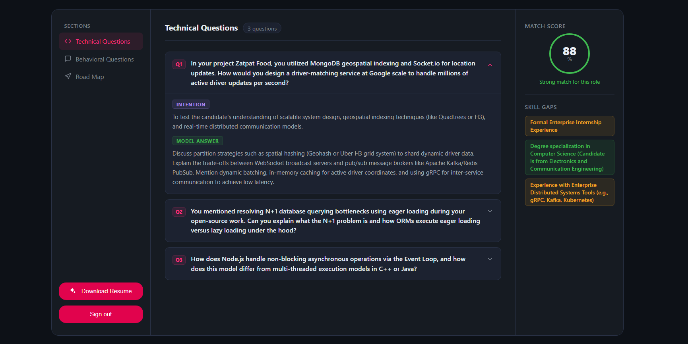
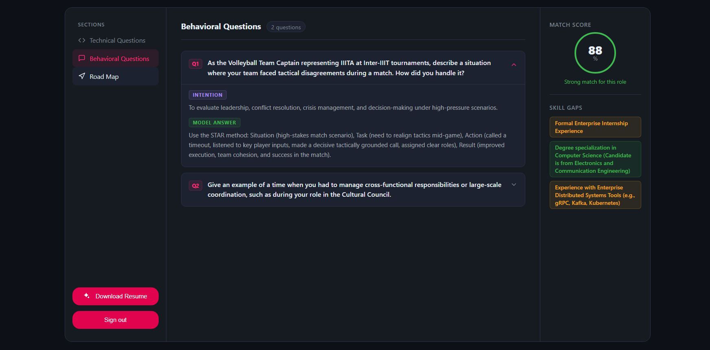
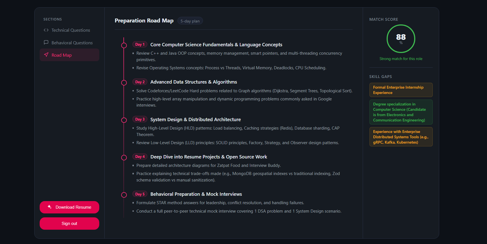
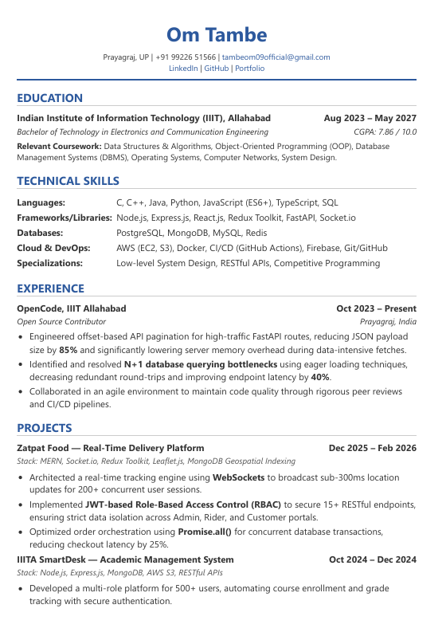
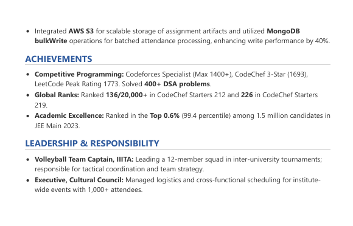
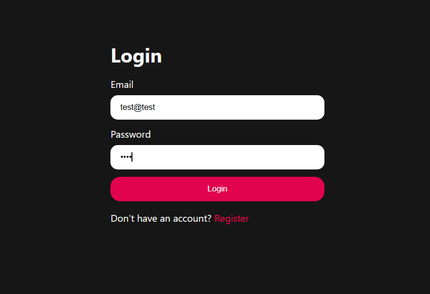
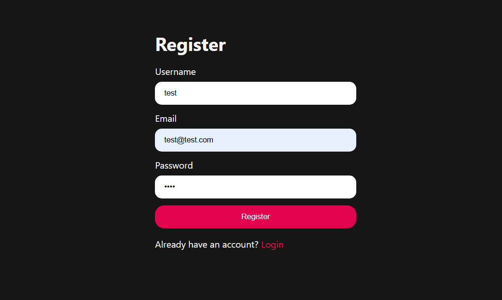

# 🤖 Interview Buddy 

An AI-powered, full-stack interview preparation platform that analyzes candidate resumes against job descriptions to dynamically generate custom technical questions, behavioral assessments, and targeted multi-day study roadmaps.

---

## 📸 Application Gallery

### 🎛️ Strategy Dashboard
Generate a personalized interview strategy by providing a target job description and uploading a resume.


### 💻 Technical & Behavioral Assessments
Receive highly specific, role-tailored technical and behavioral questions complete with interviewer intentions and model STAR-method answers.



### 🗺️ Preparation Roadmap
Get a structured, day-by-day preparation plan to close identified skill gaps before the interview.


### 📄 AI-Generated ATS-Friendly Resume
Automatically generate a highly optimized, dynamically rendered PDF resume tailored specifically to the target job description.
<div align="center">
  
  
</div>

### 🔐 Secure Authentication
JWT-based authentication with encrypted credentials and session blacklisting.
<div align="center">
  
  
</div>

---

## ✨ Core Engineering Features

* **Dynamic AI Assessments:** Leverages the **Google Gemini API** to generate highly personalized interview questions and skill gap analyses based on parsed resume data.
* **Structured AI Outputs:** Utilizes **Zod** for strict schema validation, ensuring the LLM returns predictable, parsable JSON data rather than unstable markdown strings.
* **On-the-Fly PDF Generation:** Processes AI-generated HTML payloads using a headless **Puppeteer** browser to create and stream PDF buffers directly to the client.
* **Secure Session Management:** Implements custom **JWT authentication** using HTTP-only cookies, combined with a **MongoDB-backed token blacklisting** architecture to securely invalidate sessions upon logout.
* **Memory-Efficient File Handling:** Utilizes **Multer** with memory storage to securely process PDF uploads (`pdf-parse`) on the server without straining disk I/O.

---

## 🛠️ Tech Stack

**Frontend Environment:**
* **Framework:** React.js (Vite)
* **State Management:** React Context API & Custom Hooks
* **Routing:** React Router DOM
* **HTTP Client:** Axios
* **Styling:** SCSS

**Backend & Architecture:**
* **Server:** Node.js & Express.js
* **Database:** MongoDB & Mongoose (NoSQL)
* **AI Integration:** Google Gemini API (`@google/genai`)
* **Document Processing:** Puppeteer (Headless Browser) & `pdf-parse`
* **Validation & Security:** Zod, JSON Web Tokens (JWT), Bcrypt

---

## 🚀 Local Setup & Installation

### Prerequisites
* Node.js installed locally
* MongoDB instance (local or Atlas)
* Google Gemini API Key

### 1. Clone the Repository
```bash
git clone [https://github.com/Omtambe99/Interview_Buddy.git](https://github.com/Omtambe99/Interview_Buddy.git)
cd Interview_Buddy
```

### 2. Backend Setup
Navigate to the backend directory and install dependencies:
```bash
cd Backend
npm install
```

Create a `.env` file in the `Backend` directory and add the following variables:
```env
PORT=3000
MONGO_URI=your_mongodb_connection_string
JWT_SECRET=your_jwt_secret_key
GOOGLE_GENAI_API_KEY=your_gemini_api_key
GEMINI_MODEL=gemini-3-flash-preview
```

Start the backend server:
```bash
npm run dev
```

### 3. Frontend Setup
Open a new terminal, navigate to the frontend directory, and install dependencies:
```bash
cd Frontend
npm install
```

Start the Vite development server:
```bash
npm run dev
```

The application will now be running on `http://localhost:5173`.
